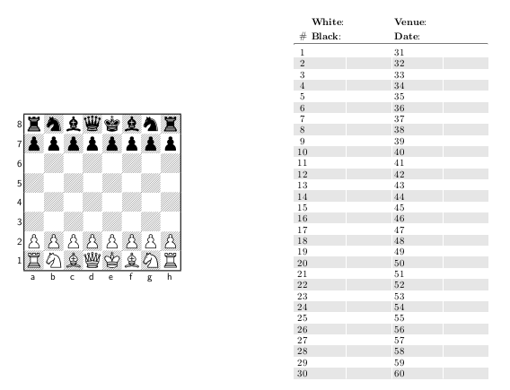

# Chess score sheet

Simple scoring sheet done in LaTeX.

## Features

- Default board configuration is reported in the first page along with PGN legend: ideal for beginners
- It fits 15 games, just enough for a world championship final
- Written with [skak](https://www.ctan.org/pkg/skak) and [tikz](https://www.ctan.org/pkg/pgf), so it can be expanded and customised at will
